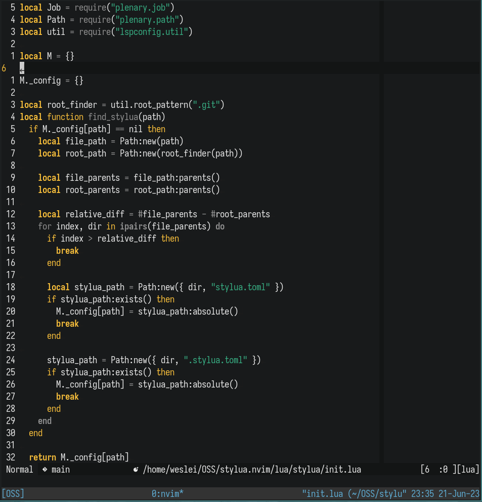
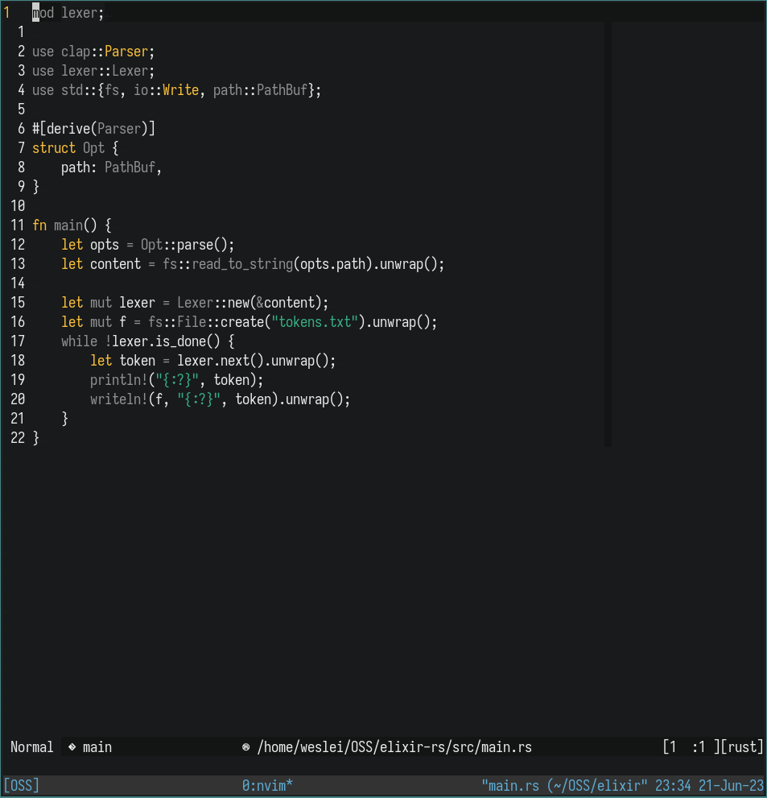

# Sitrusbuddy

Another neovim 256-color theme using [colorbuddy].

[colorbuddy]: https://github.com/tjdevries/colorbuddy.nvim

## Screenshots

### Lua



### Rust



## Installation

```vim
" Using vim-plug
Plug "tjdevries/colorbuddy.vim"
Plug "wesleimp/sitrusbuddy.nvim"
lua require("colorbuddy").colorscheme("sitrusbuddy.nvim")
```

```lua
-- Using packer
use ({ "wesleimp/sitrusbuddy.nvim", requires = "tjdevries/colorbuddy.vim" })
require("colorbuddy").colorscheme("sitrusbuddy")
```
